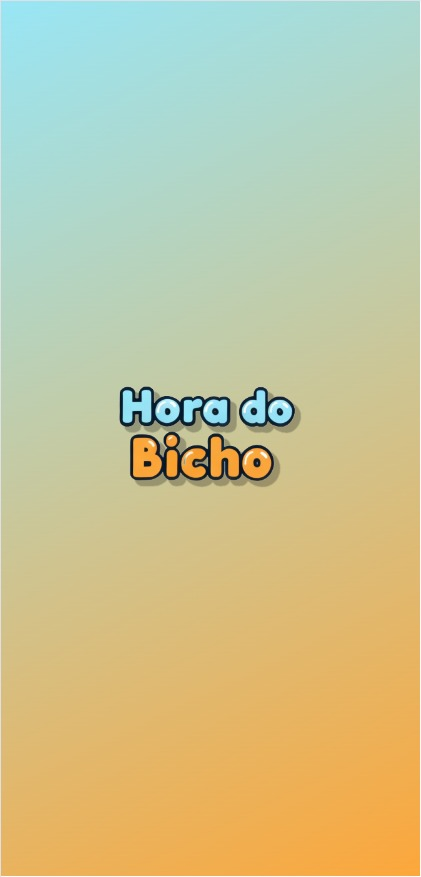
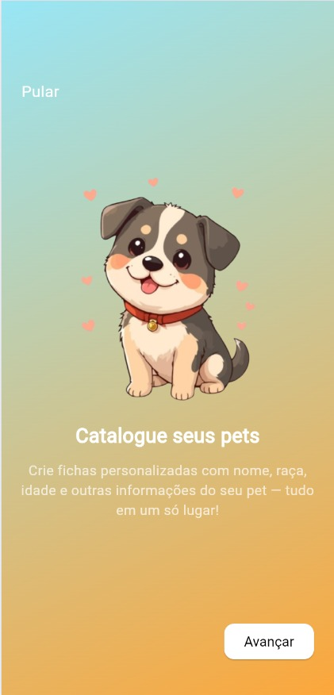
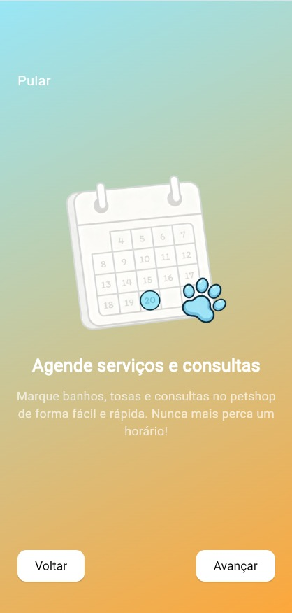
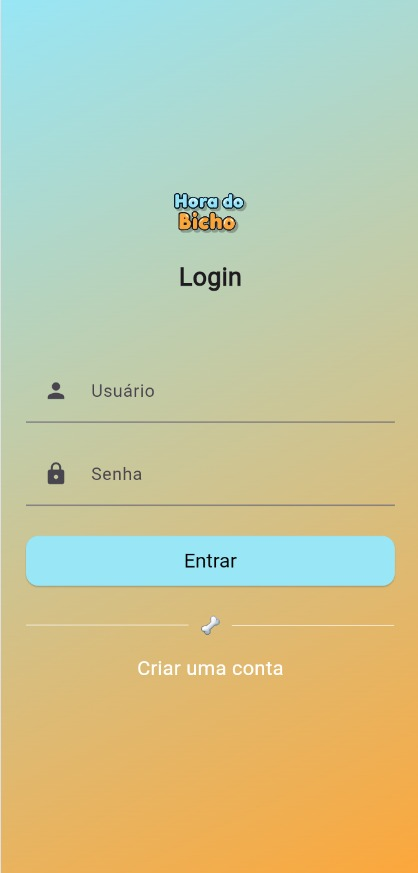
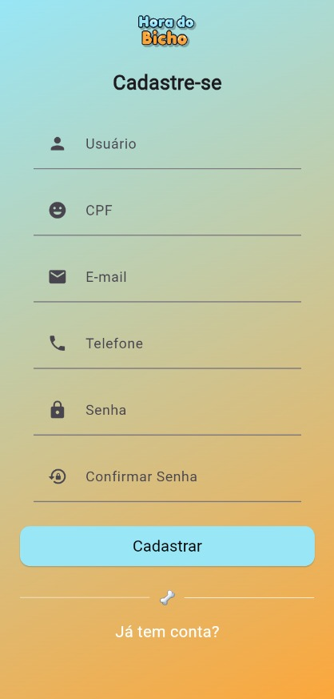
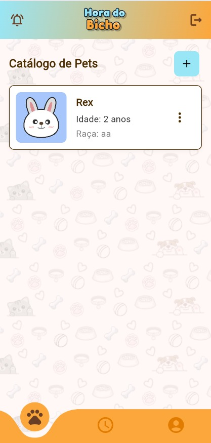
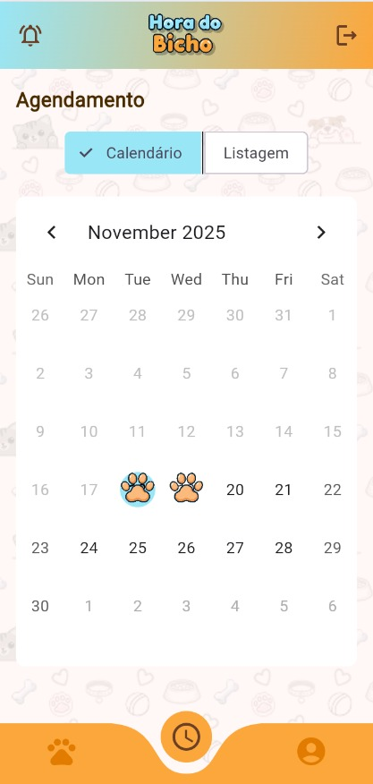
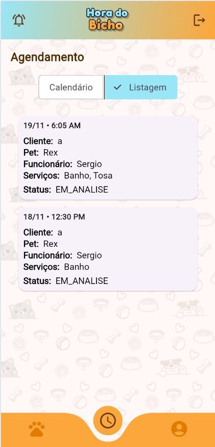
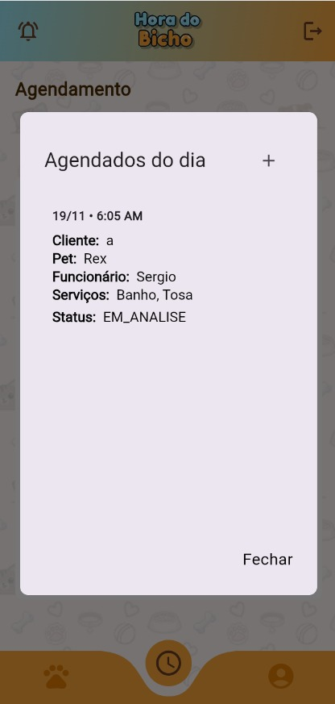
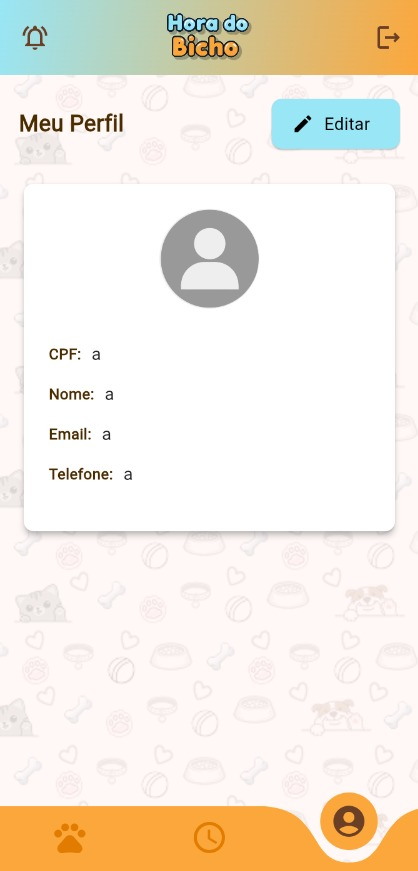

<h1 align="center"> Hora do Bicho </h1>

O projeto consiste em um app de agendamento de horários, serviços, profissionais ou consulta em um petshop, sem ter todo aquele trabalho de ir ao local ou ligar para marcar. 

  <a href="#-tecnologias">Tecnologias</a>

 

  
  
  
  
  
  
  
  
  
  
  

## 🎓 Tecnologias

Esse projeto foi desenvolvido com as seguintes tecnologias:

- Flutter / Dart
- Java
- Spring boot
- Git e Github

---

<h4 align="center">By: Isaluh - feat:  Augusto Lobo</h4>